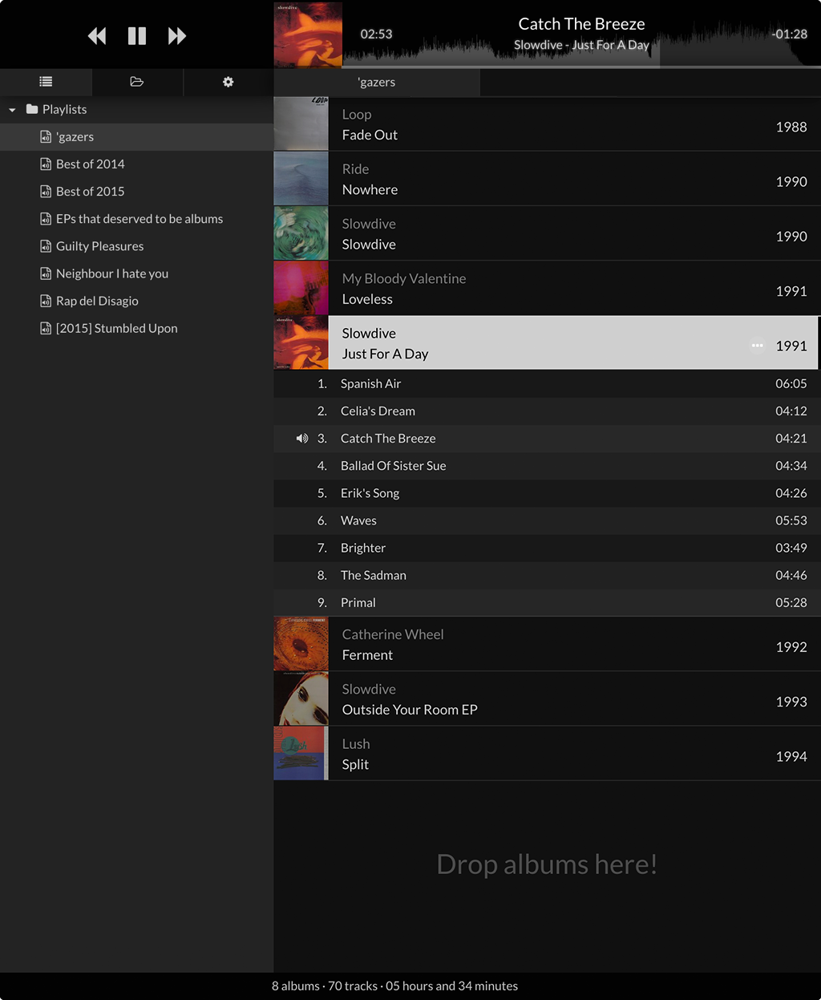

# Playa

**Playa** is the OS X audio player for those who enjoy thinking in playlist of beautiful albums, rather than shuffling over messed collections.

## Features

- Plays `mp3`, `m4a`, `flac`, `ogg` files;
- open playlists in multiple tabs;
- displays track [waveform](https://github.com/andrewrk/waveform);
- displays album cover art from [Discogs](https://www.discogs.com/developers/).

## Philosophy

I put it straight: in ~ 10 years of OS X usage, I never found a music player that completely satisfied my needs, mostly because of playlist organisation.
Most players, if not all, handle playlists as a list of _tracks_, rather than as a list of _albums_, the latter being at least for me the atom of the listening experience.

So now that I found a solid match between a low level audio player, and an application environment easy to work with (namely [Electron](https://github.com/atom/electron)), I stopped whining and started working on my idea of audio player, soon a _concrete_ audio player.

## Install

Playa delivers sound to your loudspeakers (and eventually to your ears) via [libgroove](https://github.com/andrewrk/libgroove).  
As I haven't found a way to pack it with the app itself, you have to install it via `brew`:

    $ brew install libgroove

Then either download the latest build from here, or build manually (warning: it takes ages, because it has to build the whole Electron):

    // NOTE: you should run everything w/ node 0.10.36, nvm is your friend

    $ script/bootstrap
    $ script/build

    // take a coffee, or better watch an episode of your favourite series
    $ script/run

---

Note: in order to use [Discogs webservice](https://www.discogs.com/developers/) you need to obtain a Consumer Key/Secret pair from them and create `settings/discogs.json` using following template:

    {
      "DISCOGS_KEY"     : <yourDiscogsKey>,
      "DISCOGS_SECRET"  : <yourDiscogsSecret>
    }

## Roadmap

Plans for the close future are:

- **Last.fm** scrobbling;
- **Remote control** over HTTP/Websockets, via a simple HTML5 interface;
- Implementation of `MetaDoctor`, an interface driven process that help you **solve track metadata problems** when importing media to playlists.

Plans for the not-so-close future:

- **search feature** over a library, whose changes are monitored (see [Watchman](https://facebook.github.io/watchman/));
- inclusion of **URLs** in playlists (Youtube, Soundcloud, Bandcamp...).

## Known issues

- no drag and drop of multiple albums/folders;
- when going back to already played items, seek does not reset to initial position.

## License

The MIT License (MIT)

Copyright (c) 2015 Diego Caponera

Permission is hereby granted, free of charge, to any person obtaining a copy
of this software and associated documentation files (the "Software"), to deal
in the Software without restriction, including without limitation the rights
to use, copy, modify, merge, publish, distribute, sublicense, and/or sell
copies of the Software, and to permit persons to whom the Software is
furnished to do so, subject to the following conditions:

The above copyright notice and this permission notice shall be included in
all copies or substantial portions of the Software.

THE SOFTWARE IS PROVIDED "AS IS", WITHOUT WARRANTY OF ANY KIND, EXPRESS OR
IMPLIED, INCLUDING BUT NOT LIMITED TO THE WARRANTIES OF MERCHANTABILITY,
FITNESS FOR A PARTICULAR PURPOSE AND NONINFRINGEMENT. IN NO EVENT SHALL THE
AUTHORS OR COPYRIGHT HOLDERS BE LIABLE FOR ANY CLAIM, DAMAGES OR OTHER
LIABILITY, WHETHER IN AN ACTION OF CONTRACT, TORT OR OTHERWISE, ARISING FROM,
OUT OF OR IN CONNECTION WITH THE SOFTWARE OR THE USE OR OTHER DEALINGS IN
THE SOFTWARE.
